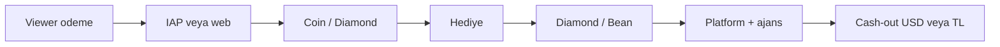

# Coin ekonomi benchmark + kilitli oranlar

Araştırma tarihi: 23 Eylül 2026.  
Kur referansı: **1 USD ≈ 48,8 ₺** (TCMB gösterge ~48,75–48,84).

Bu belge rakiplerin cent/dolar bandını özetler, **hedef bandı seçer** ve MUTA’da **üç ekonomik sabiti kilitler**. Host’a net TL UI ayrı iş olarak son bölümde belirtilir — bu turda runtime kodu değişmez.

Kaynaklar üçüncü taraf calculator / recharge listeleri; resmi “her ülkede sabit” yayın yok. ABD web/recharge bandı referans; iOS/Android IAP genelde **+%20–30** daha pahalı (mağaza komisyonu).

---

## 1) Rakip — viewer alış (1 birim)

| Platform | Birim | Yaklaşık maliyet (USD) | Cent | Not |
|---|---|---|---|---|
| **TikTok LIVE** | 1 Coin | **$0.010–0.013** | **1,0–1,3 ¢** | Web ~$0.0104–0.0106; app ~$0.013 (100 coin ≈ $1.29) |
| **Twitch** | 1 Bit (alış) | **~$0.014** | **~1,4 ¢** | 100 Bit ≈ $1.40; streamer’a $1 gider |
| **BIGO Live** | 1 Diamond | **$0.016–0.031** | **1,6–3,1 ¢** | Web ~$0.0196 (100/$1.96); IAP ~$0.031 |
| **YouTube** | Super Chat vb. | Doğrudan USD | — | Sanal coin yok; creator net gelirin **%70**’i |

## 2) Rakip — creator cash-out

| Platform | Kazanç birimi | Cash-out | Cent / birim | Platform payı (kabaca) |
|---|---|---|---|---|
| **TikTok** | Diamond | **$0.005 / diamond** (200 diamond = $1) | **0,5 ¢** | Viewer harcamasının ~%50’si creator’a |
| **Twitch Cheer** | Bit | **$0.01 / bit** | **1,0 ¢** | Kesinti alış fiyatında |
| **BIGO** | Bean | **210 bean = $1** → **~$0.00476** | **~0,48 ¢** | Diamond→bean bölgesel; cash-out sabit |
| **YouTube Supers** | USD | Vergi/App Store sonrası **%70** | — | Platform ~%30 + mağaza |

Ortak model (TikTok / BIGO): **iki birim** — viewer coin/diamond alır, host elmas/bean biriktirir, çekimde sabit oran. Cüzdan doğrudan “sadece TL” değil.



---

## 3) Karar: hedef bandı (decide-coin-band)

**Kilitli seçim: TR yerel (katalog 0,10 ₺/coin) — canlı ekonomi.**

Gerekçe:

1. Kod ve takas zaten `COIN_TRY_ORANI = 0,10` üzerine kurulu ([`CoinTryOrani.ts`](../../src/moduller/cuzdan/katalog/CoinTryOrani.ts), [`iap-stripe.md`](./iap-stripe.md)).
2. TikTok hizasına (~0,50–0,54 ₺/coin katalog) tek seferde geçmek ~**5×** fiyat şoku yaratır; ayrı fiyatlandırma işi gerekir.
3. IAP paketleri zaten katalogdan pahalı (aşağıda); mağaza geliri katalog “face value”dan bağımsız.

**Rekabet tavanı (ileride fiyat revizyonu):** TikTok bandı ~**1,0–1,1 ¢/coin** (~0,50–0,54 ₺ @ 48,8). Twitch/BIGO daha pahalı — MUTA hedefi değil.

| Band | Durum |
|---|---|
| TR yerel 0,10 ₺/coin (katalog) | **Canlı — kilitli** |
| TikTok ~1 ¢ | Referans tavan; fiyat artışı ayrı onay |
| Twitch / BIGO | Kullanılmıyor |

### MUTA vs TikTok (katalog)

| | MUTA katalog | TikTok bandı |
|---|---|---|
| 1 coin alış (USD) | 0,10 ₺ ÷ 48,8 ≈ **$0.00205 ≈ 0,21 ¢** | **~1,0–1,3 ¢** |
| Fark | — | Katalog coin ≈ **5–6× daha ucuz** (USD) |

### IAP paket efektif oran (referans, kod değişmez)

[`CoinPaketHesap.ts`](../../src/moduller/cuzdan/katalog/CoinPaketHesap.ts) pack 1–4:

| Pack | ₺ | Coin | Efektif ₺/coin | ≈ ¢ (kur 48,8) |
|---|---|---|---|---|
| 1 | 99,99 | 400 | **0,25** | ~0,51 ¢ |
| 2 | 489,99 | 1500 | **0,327** | ~0,67 ¢ |
| 3 | 999,99 | 2400 | **0,417** | ~0,85 ¢ |
| 4 | 4999,99 | 5200 | **0,962** | ~1,97 ¢ |

Pack 1–3 TikTok’un altında/yanında; pack 4 üstünde. Katalog 0,10 ₺ = **takas / hediye face value**, IAP sticker fiyatı değil.

---

## 4) Üç kilitli sabit (lock-three-rates)

Canlı ürün için aşağıdaki üçlü **kilitli**. Değişiklik admin + migration + bu belge güncellemesi ister.

| # | Sabit | Değer | Kaynak / anlam |
|---|---|---|---|
| **A** | Coin alış (katalog) | **1 coin = 0,10 ₺** | `COIN_TRY_ORANI` — takas katalog değeri, hediye ekonomik yüzü |
| **B** | Elmas cash-out | **1 elmas = 0,10 ₺** | `ElmasTryKarsiligi` — çekilebilir bakiye yüzü; cüzdan elması zaten ajans sonrası |
| **C** | Platform + ajans payı | **Platform ~%20 (katalog)** + **ajans %20 (elmas)** | Hediye: `diamond_value ≈ coin_cost × 0,8`. Ajans: `agency_share` default **0,20** (`agency_commission_rates`); host cüzdanına kalan ~%80 elmas |

### Net host (formül — değişmez)

```
viewer_harcama_try ≈ coins_spent × 0,10
brüt_elmas           = gift.diamond_value × adet   ≈ coins_spent × 0,8
ajans_kesinti        = floor(brüt_elmas × agency_share)   # varsayılan 0,20
host_elmas (cüzdan)  = brüt_elmas − ajans_kesinti
host_net_try         = host_elmas × 0,10
```

Ajanssız host: harcanan coin’in ~**%80**’i elmas/TL yüzü.  
Ajanslı (0,20): ~**%64** (0,8 × 0,8).

TikTok referansı: viewer harcamasının ~**%50**’si creator’a — MUTA host payı (ajanssız) daha cömert; ajanslı ~TikTok’a yakın.

### Bilinçli olarak kilitlenmeyenler

- IAP mağaza sticker fiyatı (Apple/Google / `priceTry` paket satırı)
- USD/TRY günlük kur (katalog sabit TL; kur sadece benchmark için)
- TikTok’a fiyat hizalama (ayrı ürün kararı)

---

## 5) Sonraki iş: host net TL gösterimi (then-ui-tl)

**Bu turda uygulanmaz.** Oranlar kilitli; UI ayrı PR.

### Kapsam (öneri)

1. **Elmas birimi kalır** (DB / RPC / çekim `diamonds` — TikTok/BIGO modeli).
2. Host cüzdan + `/host` + çekim ekranında ikincil satır: **net ≈ `ElmasTryKarsiligi(wallet.diamonds)` ₺**.
3. Dil: *katalog değeri / çekilebilir karşılık* — “garanti banka bakiyesi” vaat etme (çekim onayı + `CEKIM_ODEME_IS_GUNU` ayrı).
4. İsteğe bağlı kırılım kartı: brüt elmas → ajans → net elmas → net ₺ (ledger’dan; `agency_commission`).
5. Çekim talebi birimi elmas kalır; onay UI’sında “≈ X ₺” gösterilir — `withdrawal_requests` şeması değişmez ta ki ayrı cash-out işi açılsın.

### Dokunulacak yerler (ileride)

- [`app/(tabs)/wallet.tsx`](../../app/(tabs)/wallet.tsx) — elmas paneli
- [`app/host/index.tsx`](../../app/host/index.tsx) — `gift_income_diamonds` yanı
- [`ElmasTryKarsiligi`](../../src/moduller/cuzdan/katalog/CoinTryOrani.ts) — tek dönüşüm; yeni oran uydurma

### Yapılmayacaklar (bu takip işinde)

- Elması DB’den silip her şeyi TL’ye çevirmek
- `COIN_TRY_ORANI` / hediye `diamond_value` toplu yeniden fiyat
- Apple/Google IAP cash-out ile karıştırma (bkz. [`iap-stripe.md`](./iap-stripe.md))

---

## Özet

| Karar | Sonuç |
|---|---|
| Hedef band | **TR yerel** (katalog 0,10 ₺); TikTok ~1 ¢ sadece tavan referans |
| A Coin alış | **0,10 ₺** (admin dial ile değişir) |
| B Elmas cash-out | **0,10 ₺** (admin dial ile değişir) |
| C Paylar | Katalog **gift_host_share** + ajans **default_agency_share** |
| Net TL UI | Host ekranı ayrı; formül `ElmasTryKarsiligi` + canlı config |

---

## 6) Admin yönetimi (Ekonomi Merkezi)

Ekran: **Admin → Ekonomi merkezi** (`/admin/ekonomi`).

| Dial / araç | DB | Etki |
|---|---|---|
| 1 coin = ₺ | `platform_economy_config.coin_try` | Katalog yüzü, simülatör coin sayısı, `CoinTryKarsiligi` |
| 1 elmas = ₺ | `diamond_try` | Çekim yüzü, `ElmasTryKarsiligi` |
| Hediye host payı % | `gift_host_share` | “Kataloga uygula” → `diamond_value = floor(coin_cost × share)` |
| Varsayılan ajans % | `default_agency_share` | Yeni ajans `agency_commission_rates` (INSERT trigger) |
| Mağaza % tahmini | `iap_store_fee_estimate` | Yalnızca simülatör (gerçek IAP mağazadan) |
| Kâr simülatörü | `admin_ekonomi_simule_et` | Brüt ₺ → mağaza / IAP net / host / ajans / platform kalan |
| Paket düzenle | `admin_coin_paket_guncelle` | coins, bonus, price_try (Store Product ID kilitli) |
| Hediye düzenle | `admin_hediye_guncelle` | coin_cost, diamond_value, isim… |

Oran değişince **yalnızca yeni hediyeler / yeni çekim yüzü** etkilenir; mevcut cüzdan bakiyeleri değişmez.

Client: `ekonomi_config_getir` → [`EkonomiOranlariniGetir.ts`](../../src/moduller/cuzdan/katalog/EkonomiOranlariniGetir.ts) (Auth oturumunda ısıtılır).
